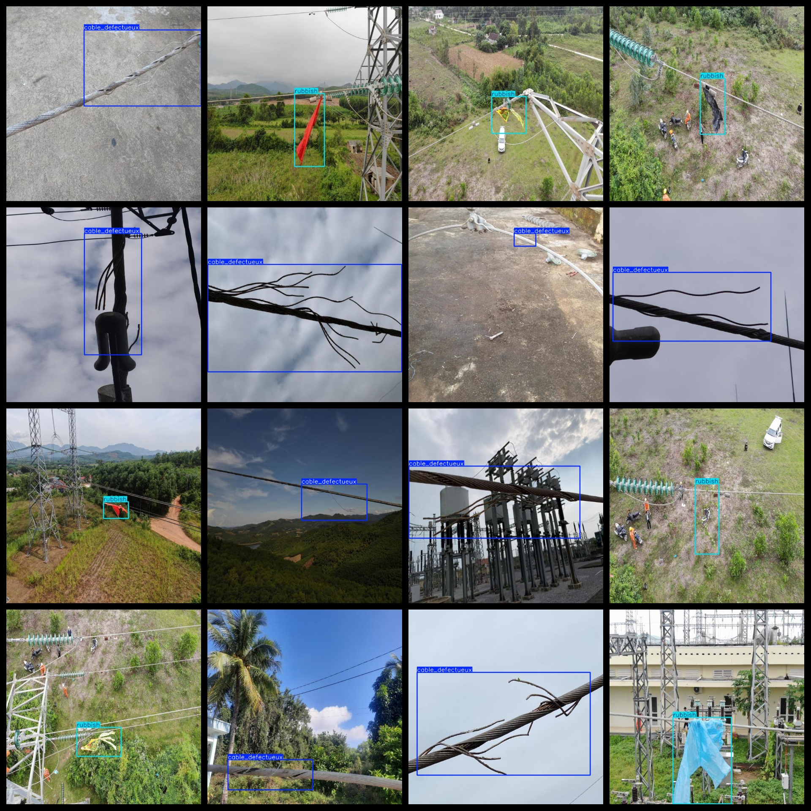

# Transmission Line Defect Detection Dataset （Cable Wire Harness Fracture 、 Hang Garbage ）1393 imagesVOC+YOLO

Transmission line defect detection dataset (cable harness wire breakage, hanging garbage) 1393 VOCs + YOLOs

Dataset format: Pascal VOC format + YOLO format (the txt file does not contain the split path, it only contains jpg images and corresponding VOC format xml files and yolo format txt files)

Number of images (total number of jpg files): 1393

Number of XML files: 1393

Number of txt files: 1393

Label count: 2

The Github repository is: datasets_sl

["cable_defective", "rubbish"]

Number of boxes labeled in each category:

Cable_defective = 998

rubbish frame count = 403

Total frames: 1401

Number of images per category:

Cable_Defective_Unexpected = 992

The number of pictures owned by rubbish = 401

Image resolution: 640x640

Use the labeling tool: labelImg

Dataset Augmentation: No

Rules for annotation: Draw a rectangle around the category.

Important note: The dataset does not have been divided into training, validation, and testing sets.

Special Disclaimer: This dataset does not guarantee the accuracy of the trained models or weight files.

Annotation and image details are as follows:

## Images

---

Here is a pay link on Stripe (https://buy.stripe.com/3cs8yP7sY87d0vu9AB). Please contact me lonlonago@foxmail.com after funding $89, and I will send you a complete data files, thank you!

